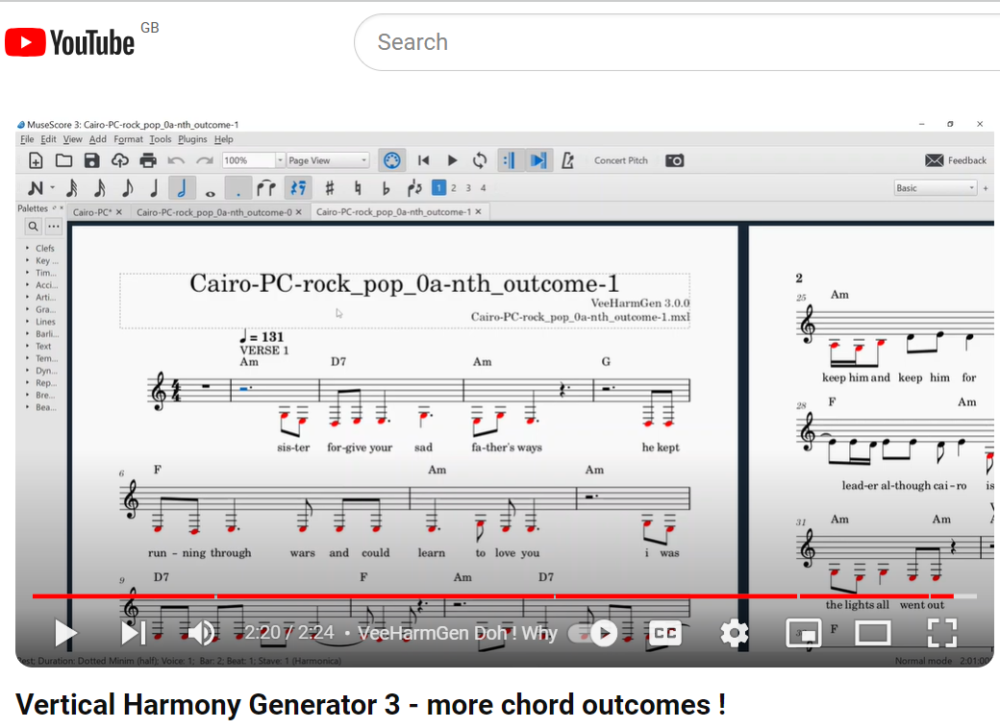
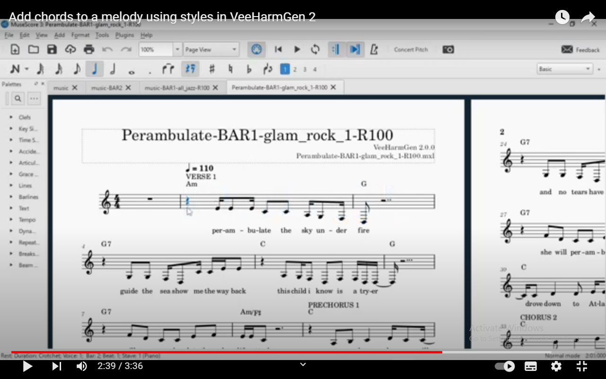
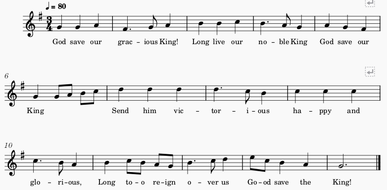
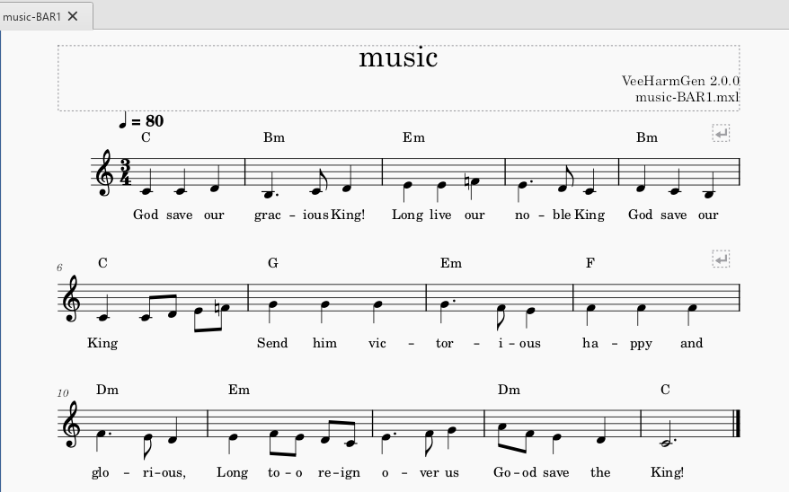
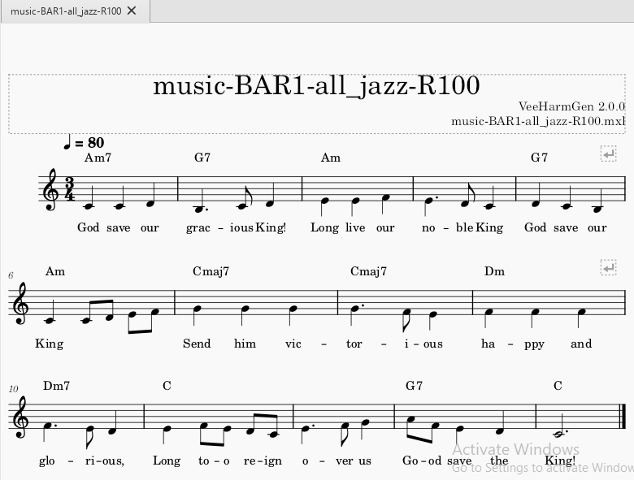
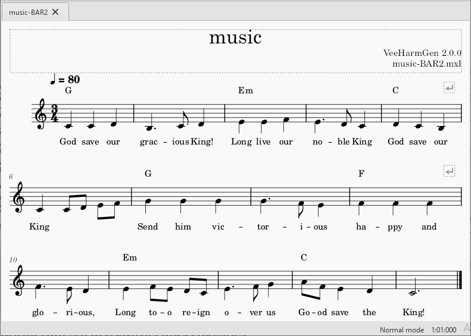
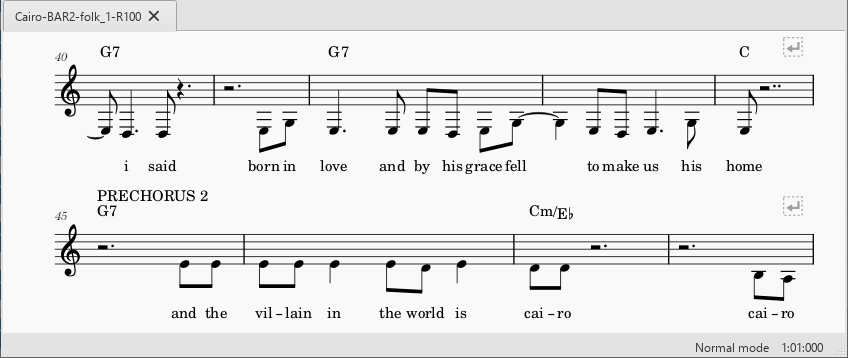

# VeeHarmGen
This tool is part of the MarkMelGen ecosystem / toolchain and is part of the latest [MarkMelGen release](https://github.com/RedFerret61/MarkMelGen/releases).

VeeHarmGen adds chords to a melody using various pop, jazz and classical chord style files. It is a **Ve**rtical **Harm**ony **Gen**eration program that 
takes an **input** musicxml file containing a **melody** and placeholder chord symbols (temporary chords that give a harmonic rhythm) and
creates **output** musicxml files with more elaborate or (hopefully) fitting **Chord Symbols**.
These can be played back and edited in scorewriter programs
such as MuseScore 3.6.2.

There is a VeeHarmGen 3 demonstration video on youtube: https://youtu.be/Be0aRNpcL7k 

There is a VeeHarmGen 2 demonstration video on youtube: https://www.youtube.com/watch?v=3fv-eC-yg7I

The latest release has been tested on: 
- Windows 10 Version 22H2 build 19045.3930 with 
  - MuseScore 3.6.2,    Python 3.12.1,  music21 v 9.1.0 
- macOS Monterey 12.01 with
  - MuseScore 3.6.2,    Python 3.11.4,   music21 v 9.1.0
- Ubuntu 22.04.3 LTS with 
  - MuseScore 3.2.3,    Python 3.10.12,  music21 v 9.1.0

## VeeHarmGen Command-line Usage

    $ VeeHarmGen.py -h
    usage: VeeHarmGen.py [-h] [-m MXLFILE] [-a] [-b BAR] [-c {rank,nth_outcome,infer}] [-d DEMO] [-f {mxl,musicxml}] [-i INSTRUMENT]
                        [-n {0,1,2,3,4,5,6,7,8,9,10,11,12,13,14,15,16,17,18,19,20,21,22,23,24,25,26,27,28,29,30,31,32,33,34,35,36,37,38,39,40,41,42,43,44,45,46,47,48,49,50,51,52,53,54,55,56,57,58,59,60,61,62,63,64,65,66,67,68,69,70,71,72,73,74,75,76,77,78,79,80,81,82,83,84,85,86,87,88,89,90,91,92,93,94,95,96,97,98,99,100}]
                        [-p PITCH_CLASS] [-s STYLE] [-t {-12,-11,-10,-9,-8,-7,-6,-5,-4,-3,-2,-1,0,1,2,3,4,5,6,7,8,9,10,11,12}] [-v]

    options:
    -h, --help            show this help message and exit
    -m, --mxlfile MXLFILE
                            MusicXML input file with the extension .mxl (compressed) relative to current working directory. Example 1:
                            input/music/music.mxl (without placeholder chords, outputs files with placeholder chords at offsets beat1
                            beat2 bar1 bar2 bar4) Example 2: input/music/placeholder_chords/music.mxl (with placeholder chords, outputs
                            a file with chords in placeholders for each input/style). To manually add placeholders for where chords are
                            desired, in MuseScore, to create a Chord Symbol: select start note and then use the menu option Add > Text
                            > Chord Symbol (shortcut Ctrl+K) e.g. C or the song key.
    -a, --auto-transpose  automatically transpose to optimal key for analysis (default: False)
    -b, --bar-pitch-class BAR
                            Return the pitch classes for the given bar, >=1, of the melody.
    -c, --chord_choice {rank,nth_outcome,infer}
                            chord_choice may be rank which uses a nearest-rank ordered list of possible chords in a style; or
                            nth_outcome where number is the number of outcomes away from the most popular outcome in a style; or infer
                            which uses Pitch-class template–based chord inference where number is a randomness control from strict to
                            creative.
    -d, --demo DEMO       demonstrate some different commonly used chords and harmonic rhythms.
    -f, --out-format {mxl,musicxml}
                            output format: "mxl" for compressed .mxl or "musicxml" for uncompressed .musicxml
    -i, --instrument INSTRUMENT
                            melody instrument default is Piano, alternatively enter one of: Accordion, "Acoustic Bass", "Acoustic
                            Guitar", Alto, "Alto Saxophone", Banjo, Baritone, "Baritone Saxophone", Bass, Bassoon, "Bass Trombone",
                            Brass, Celesta, Clarinet, Clavichord, Contrabass, Contrabassoon, Dulcimer, "Electric Bass", "Electric
                            Guitar", "Electric Piano", "English Horn", Flute, Glockenspiel, Guitar, Harmonica, Harp, Kalimba, Koto,
                            Lute, Marimba, Oboe, Ocarina, "Pan Flute", Piccolo, Recorder, "Reed Organ", Saxophone, Shamisen, Sitar,
                            Soprano, "Soprano Saxophone", Tenor, "Tenor Saxophone", Timpani, Trombone, Trumpet, Tuba, "Tubular Bells",
                            Ukulele, Vibraphone, Violin, Violoncello, Voice, Xylophone
    -n, --number {0,1,2,3,4,5,6,7,8,9,10,11,12,13,14,15,16,17,18,19,20,21,22,23,24,25,26,27,28,29,30,31,32,33,34,35,36,37,38,39,40,41,42,43,44,45,46,47,48,49,50,51,52,53,54,55,56,57,58,59,60,61,62,63,64,65,66,67,68,69,70,71,72,73,74,75,76,77,78,79,80,81,82,83,84,85,86,87,88,89,90,91,92,93,94,95,96,97,98,99,100}
                            number used with the chord_choice e.g. if chord_choice is rank then number 100 is the most frequent and 1
                            is least frequent in the nearest-rank ordered list of possible chords. [100-75] recommended rank number; if
                            chord_choice is nth_outcome then number 0 is most popular, 1 is next outcome after the most popular outcome
                            etc. At then end of outcomes the choice loops back to the most popular. [0-3] recommended nth_outcome
                            number; if chord_choice is infer then number 0 is deterministic choosing the highest score, 100 is the
                            weakest valid match among valid chords.
    -p, --pitch_class PITCH_CLASS
                            pitch class in binary format e.g. "1000 0000 0000" to lookup chord for that pitch class. Must be used with
                            -s/--style flag. Prints the chord and exits.
    -s, --style STYLE     style filter string on files in input/style directory e.g. -s jazz only includes style names containing the
                            string jazz
    -t, --transpose {-12,-11,-10,-9,-8,-7,-6,-5,-4,-3,-2,-1,0,1,2,3,4,5,6,7,8,9,10,11,12}
                            transpose input file down or up t semitones (to override default "analyze" transpose to C / a minor)
    -v, --version         show program's version number and exit

**Table of Contents**

- [Changes](#Changes)
- [QuickStart](#QuickStart)
- [Introduction](#Introduction)
- [AlternativeChords](#AlternativeChords)
- [StylesEvaluation](#StylesEvaluation)
- [Prerequisites](#Prerequisites)
- [WindowsInstall](#WindowsInstall)
- [macOSInstall](#macOSInstall)
- [UbuntuInstall](#UbuntuInstall)
- [Input_Music](#Input_Music)
- [Output](#Output)
- [ToolsForStyleCreation](#ToolsForStyleCreation)

*Note: GitHub has a full table of contents with links in the header icon (top left of the readme.md).*

---
## Changes

- v3.1.0 2025. Add a chord_choice of infer and alternative chords help. 
- v3.0.0 2024. Add more chord styles, style evaluation in Introduction and a chord_choice of nth_outcome away from the most popular chord outcome.
- v2.0.0 2023. Add chord styles and a chord_choice of rank which uses a nearest-rank ordered list of possible chords.
- v1.0.0 2022. Initial version uses key analysis on input music melody slices to produce chords.

## QuickStart

Assuming you have:
- the pre-requisites (MuseScore, Python, and Music21)
- performed the VeeHarmGen install for your platform
- a music.mxl file in the input/music directory with a single stave monophonic melody, e.g.

### Windows
Start cmd

    cd <install folder>
    run music

Start explorer, goto the output folder under VeeHarmGen, double click on a .mxl file to view in MuseScore.

### macOS / Ubuntu
Start a terminal

    cd ~/VeeHarmGen
    chmod a+x *.sh
    
    ./run.sh music

Use finder / file manager to goto the output directory under VeeHarmGen, double click on a .mxl file to view in MuseScore.

e.g. this uses **tune slice key analysis** to add chords:

e.g. this uses the **all_jazz chord style** to add chords:

---
## Introduction

VeeHarmGen is a Vertical Harmony Generation program that 
takes an input musicxml file containing a melody and 
creates output musicxml files with added Chord Symbols.

VeeHarmGen expects two types of input files : 

- tunes **without sections** where the generated harmonic rhythm (beats or bars per chord ) will be continous throughout the song.
For example music with a generated 2 bar harmonic rhythm:

- tunes **with sections** (from MarkMelGen https://github.com/RedFerret61/MarkMelGen ) where the generated harmonic rhythm will restart on each section (denoted by staff text to identify the section start point: 
                intro, verse, prechorus, chorus, solo, bridge or outro). For example 
the previous section to the PRECHORUS ends with a 1 bar chord, and the PRECHORUS restarts the 2 bar chord rhythm.

VeeHarmGen version 1 used the **tune slice key analysis** feature in Music21 to add chords. 
(see https://web.mit.edu/music21/doc/usersGuide/usersGuide_15_key.html ).
However instead of analysing the whole piece, the tune is sliced into differently sized windows of analysis to get the key every quarter note, 
every half note, every measure, every two measures, etc.  Each key becomes a chord for the slice e.g. C or Am,
This works when there are severel different pitches in the tune slice.
When there is only one note in a slice, the result is ambiguous e.g. the key/chord may be Em or E. 
The the key analysis method of chord selection is selected with the -d DEMO option to demonstrate some different 
commonly used chords and harmonic rhythms.

VeeHarmGen version 2 introduced preset **chord styles** of a map of the pitch classes to chords. 
By default output is generated for all styles.
The -s STYLE option can be used to filter the generated output e.g. -s jazz only includes style names containing the string jazz.
See VeeHarmGen/input/style for the set of styles and "all" superset styles.

VeeHarmGen version 3 added more chord styles (Classical, Film and Game), a style evaluation (see below)
 and a chord_choice of nth_outcome away from the most popular chord outcome and a run_out script to use it e.g.
    
    run_out
       USAGE: run_out n style instrument mxlfile
       where n is the last outcome (outcomes start at 0)
             style is a style filter string on files in input/style directory
             instrument is used by the output melody (chords are Piano), for instruments, see python VeeHarmGen.py -h
             mxlfile has placeholder chords and includes path
       Output for chord outcomes is in written to the output directory
       Examples:
       run_out 1 _pop_ Harmonica input/music/placeholder_chords/Cairo-PC.mxl
	   run_out 2 pop_country_1 Violin input/music/placeholder_chords/Cairo-PC.mxl
       run_out 3 all_contemporary Piano input/music/placeholder_chords/Cairo-PC.mxl

## AlternativeChords
If you need help with choosing alternative chords, use the flags:

    -b, --bar-pitch-class BAR
    -p, --pitch_class PITCH_CLASS

e.g.

    cd VeeHarmGen
    python VeeHarmGen.py -b 12 -m output\soft_rock_0--Whisper_on_the_Wind-C-bpm90-ts3_4-D3_C6-wpch-soft_rock_0-nth-1-v01.musicxml

        Pitch classes for bar 12 : 0000 0000 0001
        Pitches in pitch class: ['B']

    python VeeHarmGen.py -p "0000 0000 0001" -c nth_outcome -n 0 -s soft_rock

        number is 0
        ...
        chord_choice is nth_outcome
        get_chord_from_pitch_to_chord_by_nth_outcome(number, v) 0 {'Am': 1, 'Fmaj7': 2, 'F': 1}
        sorted_v_len 3
        iter_num, ch, ch_preferred, sorted_items 0 Fmaj7 Fmaj7 {'Fmaj7': 2, 'F': 1, 'Am': 1}
        nth_outcome ch is Fmaj7

Try one of the listed chords as an alternative chord instead.

## StylesEvaluation 
	
| - | - | - |
|---|---|---|
| STYLE NAME						| | EVALUATION 	|
| all								| | : All the styles. 	|
| - | - | - |
| all_classical						| | : All the styles with "classical" in the name. 	|
| all_contemporary					| | : All the styles that are not jazz or classical and are relatively recent. 	|
| all_film							| | : All the styles with "film" in the name. 	|
| all_game							| | : All the styles with "game" in the name. 	|
| all_jazz							| | : All the styles with "jazz" in the name. 	|
| all_traditional					| | : All the styles that are not in the above style composite subsets.	|
| - | - | - |
| blues_1								| | : Traditional, pleasing, serious, sad, with occasional modal mixture, some sus2 / sus4 / 6 / 7. 	|
| classical_baroque_7			| | : Sophisticated elegant solemn graceful complexity, mainly triadic, passing chromatic / dissonnant bass notes,  secondary dominants (In C, the dominant chord is G7, a secondary dominant would be A7 that resolves to a non-tonic), some modulation, dim / 7 / 6.  |
| classical_classical_2			| | : Predominantly triadic, unexpectedly beautiful cadences, surprise chords that resolve, sparing use of chromatic harmony (notes that do not belong to key). |
| classical_modern_1			| | : Audacious, colorful, dreamlike, evocative, floating (suspended bass) sometimes diminished triads or chromatic passing tones,  ambiguities and parallels, dim / 4 / 7.  |
| classical_renaissance_9   	| | : Dramatic, emotional, triads with chromatic alterations (notes not in scale), dissonance, modulation, modes, figured bass.  |
| classical_romantic_1			| | : Bold, innovative, mostly triads, many secondary dominants (resolve to a non-tonic), secondary leading tones (chromatics resolve to dominant), more chromaticism and dissonance than before, modulation, occasional sus / dim7 / dissonnant bass.  |
| classical_romantic_2			| | : Elegant, textured, Polish folk,  triads with chromaticism, extended chords (more than three notes), some 6, 7(b5)(sus), (b)9(#3), dim. |
| classical_romantic_5			| | : Complex, Russian folk, triads, chromatic dissonance, some sus2 / sus4 / 6 / (maj)7(b5) / dim. |
| country_rock_1						| | : Simple traditional American folk, with some jazz and blues, modulations, some sus2 / sus4 / 7. |
| country_rock_2						| | : Country folk rock & blues influences, extended chords (more than three notes), occasional baroque dissonance, some sus2 /sus4 / 6 / 7(m7add11) / 9.  |
| early_jazz_1						| | : Simple, emotional, African American, primarily triads, occasional chromatic dissonance, non-diatonic substitution (different key), higher than average chord complexity and chord-bass melody, some sus4 / 7.  |
| early_jazz_2						| | : Blues, ragtime, non-diatonic chord substitutions, some aug / 6 / 7(b5)(add13) / 9 (add13). |
| easy_listening_1						| | : Lush, romantic, chromaticism, secondary dominants (chords built on the fifth of another chord), modal interchange (borrowing chords from other modes within the same key), some 6 / 7 (b5) (b9) / 9 (sus4) / dim (7). |
| film_1								| | :  Multifaceted, Tonal Foundation, Rich and Vibrant Harmony,  chromaticism, secondary dominants, and altered dominants (modifies diatonic note(s) to chromatic, e.g. ♭5, ♯5, ♭9, and ♯9),  blend of simplicity and sophistication, tonality and chromaticism, some sus2, sus (add 7) / (dim) 7 / 9 . |
| film_2								| | :  Multifaceted and captivating, layers simple and complex chords, unconventional voicings and extended harmonies, dissonant chords, chromaticism, and altered dominants, suspended chords, some sus2 / sus / dim / 7 / 9. |
| film_3								| | :  Multifaceted, Tonal Ambiguity, blurs the lines between major and minor tonalities, modal shifts, chromaticism, unconventional voicings, extensions, minor second interval progressions, augmented chords, and open-fifth voicings, some sus2 / sus / dim / power / 6 / 7 / 9. |
| folk_1								| | : Mostly simple, diatonic chord progressions, later chromaticism, modal interchange, and secondary dominants, some surprising bass, sus4, 7 / 9. |
| folk_rock_1							| | :  Modal harmony and folk-inspired chords, such as IV-V-I (resolution) and vi-IV-I (melancholy) progressions, extended chords and non-diatonic chords, some sus2 / 6 / 7 (#3)(#5) / 9 / 11 / dim.|
| game_1								| | : Multifaceted and adaptable, tonal with chromaticism, secondary dominants, and altered dominants to build tension and suspense, while major seventh chords and sus4 chords add warmth and hope, some sus2 / sus / dim / 7 / 9 / 11. |
| game_2								| | : Primarily tonal, subtle chromaticism, modal shifts, altered dominants, some sus2 / sus / dim / 7 / 9 / 11. |
| glam_rock_1							| | : Relatively “classical” rock, pop, and gospel, often shifting between major and minor keys, slash chords (bass note from a different chord), chromatic passing chords, some sus4, 7. |
| indie_rock_1							| | : Sourced from 60s British pop, punk rock, and even classical music, used minor chords for a melancholic and introspective atmosphere, or dramatic shifts from minor to major, some Modal Interchange for tension and release (borrowing chords from the parallel major or modal scales), some sus / 6 / 7 / 9.|
| jazz_related_1					| | : Blues Influenced, with jazz traditions, Chromatic Harmony (secondary dominant, and substitution chords), some sus / 6 / (many) (aug) (dim) 7 (#5) (b5) (b9) / 9 (sus4) / 13 /aug / dim. | 
| jazz_rock_1						| | : Diverse, multifaceted blend of jazz, rock, pop, Latin and world, extended chords, altered dominants, chromaticism, some sus2 / sus / 7 (b5) (#9) (aug) / 9 / 11 / 13.   |
| jazz_standard_1					| | : Lush, romantic, and sophisticated chords, primarily traditional tonal harmony, extended Chords and Alterations such as dominant sevenths with altered tensions, Jazz Influences, chromatic passing tones, Latin bossa nova chords, samba rhythms, exotic scales, some 6 / 7 (b5) (b9) (#11) / 9. |
| modern_jazz_1						| | : Initial bebop harmony, then Modal Harmony particularly Dorian (e.g. piano keyboard's white notes from D to D) and Phrygian mode (e.g. piano keyboard's white notes from E to E), and avant-garde Bitonality and Polytonality (simultaneously superimposing two or more keys on top of each other), Chromaticism and Altered Dominants, passing tones, tension and release, some 6 / 7 (b5) (#5) (#9) (#11) (b13) / 9 / 13 / dim. |
| new_wave_1							| | : Power chords, major and minor progressions, pentatonic scales, extended chords, altered dominants, chromaticism, some power / sus2 / sus4 / 7 (sus4). |
| popular_1								| | : Simplicity, mainly Major chords (I-IV-V) with diatonicism (that avoids chromaticism with notes outside the scale), higher complexity than average in terms of Chord-Bass Melody, possible secondary dominants (that temporarily shift the key to create tension and resolve back to the main key), occasional borrowed chords (such as a minor chord from the parallel minor key, e.g. the parallel minor of C Major is C minor) some sus2 / sus4 / 6 / 7 / 9 / dim . |
| pop_country_1							| | : Pop and country use of major and minor progressions, sophisticated and elegant extended chords, altered dominants, chromaticism, lush jazz-influenced voicings, power chords some sus2 / sus4 / 7 / 9 .|
| reggae_1								| | : Emphasis on minor chords, particularly I-V-vi, using the blues scale and its associated chords (creates a warm, mellow soundscape), suspended chords delay the resolution of the harmony (creating a sense of yearning and emotional pull), dominant 7ths and major 7ths provide a jazzier feel, occasional borrowed chords or modal interchange (switching briefly between different key centers), some sus2 / 7. |
| rock_pop_0a							| | : Simplicity, mainly major chords, I-IV-V, occasional secondary dominants e.g. II-V-I, strong diatonicism, some sus2 / 7 / 9.  |
| rock_pop_0b							| | : Mature introspection, chromaticism, notes outside the key's scale, embracing minor chords and modal borrowing, some sus2 / sus4 / 7 / 9.  |
| rock_pop_1a							| | : A balance between simplicity and sophistication, limited chord vocabulary ( major, minor, dominant seventh, ccasional subdominant like IIm7), Mode mixture (borrowed chords from minor modes like Dorian or Aeolian), Jazz influences (7b9 and diminished), some sus / 6 / 7 / 9 / 11 / dim. |
| rock_pop_1b							| | : Greater Experimentation and Sophistication, expanded chord vocabulary (augmented, diminished, and altered chords - replacing a diatonic with a neighboring chromatic - e.g. maj7#11 ), some sus2 / sus4 / 6 / 7 / 9 / dim . |
| rock_pop_2							| | : Blended elements of pop, rock, folk, blues, and gospel, major and minor 7th chords, modal influences, experimentation, unusual chord combinations, some 7 / dim. |
| show_tune_1							| | : Rich and dynamic harmony, Simple Yet Sophisticated tonal harmony: with subtle chromaticism, unexpected modulations, extensions, and altered dominants (a dominant seventh chord, V7 chord, that has one or more of its tones "altered" meaning raised or lowered by a semitone to add extra tension and dissonance,e.g. G7 alter #3, the notes in this chord would be: G - B# - D - F),  some  sus / dim / aug / 6 / (dim) 7 (alter) / 9 / 11 / 13.  |
| soft_rock_0							| | : Pop harmonies with rock and blues influence, mixolydian progressions (major chord on 7th scale degree) some power / sus2 / sus4 / 7 / 9 / dim. |
| soul_1								| | : Roots in soul and blues, with a touch of pop and chord bass melody, some sus2 / sus4 / 6 / 7 / 9. |

Each slice of melody has a set of pitch classes which can be mapped to a chord in a particular style.

There are 12 pitch classes in standard Western music: C, C#, D, D#, E, F, F#, G, G#, A, A# and B. 
The pitch class C consists of the Cs in all octaves. In VeeHarmGen ptc.json files a 12-bit pattern, 
e.g. **"1000 1001 0000", represents a melody containing the pitch classes C, E and G.**  
The first bit is C, the second is C#, ..., the last bit is B.

For example, an excerpt from all-_-ptc.json:

       "1000 1001 0000": {
        "C": 30,
        "G": 3,
        "B-": 1,
        "D7": 1,
        "G9": 3,
        "Em7": 1,
        "Fmaj7": 1,
        "F#maj7": 1,
        "C6": 1,
        "A7": 6,
        "Am7": 1,
        "Am": 1,
        "Cm": 1,
        "C/E": 1
    },
	

In the above example, there is a "tune" slice with only C, E and G notes, 
where the (unsorted) chord frequencies for the "tune" included:

       30 "C" chords
       6 "A7" chords 
       3 "G" chords
       3 "G9" chords
      etc.  
   
If VeeHarmGen was given an input tune slice with only C, E and G notes, it would select the "C" chord by default,  
unless the rank command line option was supplied, where 1 is least frequent and 100 (the default) is the most frequent
in the nearest-rank ordered list of possible chords.

### Example VeeHarmGen workflow 1

- Generate harmonic rhythms
  - Choose desired harmonic rhythm e.g. BAR1 (optionally manually edit to vary the rhythm. 
  In MuseScore, to create a Chord Symbol: select start note and then use the menu option Add > Text > Chord Symbol 
  (shortcut Ctrl+K))  
- Run desired harmonic rhythm for all styles
  - Choose favourite style e.g. glam_rock_1 
- Run chosen style with a variety of chord ranks e.g. 60, 30, 1 on various instruments (for a list of instruments: python VeeHarmGen.py -h)
  - Choose favourite chord rank

Assuming Perambulate.mxl is in VeeHarmGen\input\music:

Windows commands

    python VeeHarmGen.py -m input/music/Perambulate.mxl
    python VeeHarmGen.py -m output/Perambulate-BAR1.mxl
    python VeeHarmGen.py -m output/Perambulate-BAR1.mxl -s glam_rock_1 -c rank -n 60 -i Saxophone
    python VeeHarmGen.py -m output/Perambulate-BAR1.mxl -s glam_rock_1 -c rank -n 30 -i "Reed Organ" 
    python VeeHarmGen.py -m output/Perambulate-BAR1.mxl -s glam_rock_1 -c rank -n 1 -i Celesta
 
macOS / Ubuntu commands 

    python3 VeeHarmGen.py -m input/music/Perambulate.mxl
    python3 VeeHarmGen.py -m output/Perambulate-BAR1.mxl
    python3 VeeHarmGen.py -m output/Perambulate-BAR1.mxl -s glam_rock_1 -c rank -n 60 -i Saxophone
    python3 VeeHarmGen.py -m output/Perambulate-BAR1.mxl -s glam_rock_1 -c rank -n 30 -i "Reed Organ"
    python3 VeeHarmGen.py -m output/Perambulate-BAR1.mxl -s glam_rock_1 -c rank -n 1 -i Celesta

### Example VeeHarmGen workflow 2

- Generate harmonic rhythms from an input melody file with no with placeholder chords.
  - Choose best harmonic rhythm e.g. BEAT1, BEAT2 or BAR1 
- Optionally manually edit generated chosen file to vary the harmonic rhythm. 
It may be helpful to open all the preferred harmonic rhythm files 
and copy and paste chord harmonic rhythms to the best one. 
Note: the chord names do not matter as they will be replaced later. 
  - In MuseScore:
	- to delete a chord symbol, select it and press the Delete key
	- to create a Chord Symbol: select start note and then use the menu option Add > Text > Chord Symbol 
  (shortcut Ctrl+K))  
	- To copy a harmonic rhythm, in source file, select first Chord Symbol, shift+click last chord symbol, Ctrl+C to copy.
In target file, delete any existing chords in the target bars, select first note in target bars, Ctrl+V to paste. 	
- Run desired harmonic rhythm for first 10 chord outcomes in desired style(s) e.g. country_rock_2 
- Choose favourite chord outcome

Assuming Cairo.mxl is in VeeHarmGen\input\music and Cairo-PC.mxl is created in VeeHarmGen\input\music\placeholder_chords:

Windows commands:

	wf2_no_pc Cairo
	
	"C:\Program Files\MuseScore 3\bin\MuseScore3.exe"
		- File > Open ... e.g. ...\VeeHarmGen\output\Cairo-BEAT1.mxl and BEAT2 and BAR1
		- when finished editing best file,
		- File > Export > MusicXML, Export ...,  ...\VeeHarmGen\input\music\placeholder_chords\Cairo-PC.mxl
		
	wf2_nth_outcome input/music/placeholder_chords/Cairo-PC.mxl country_rock_2

 
macOS / Ubuntu commands 

    ./wf2_no_pc.sh Cairo
	
	In Finder navigate to VeeHarmGen/output and open desired file with MuseScore
    e.g. ...\VeeHarmGen\output\Cairo-BEAT1.mxl and BEAT2 and BAR1
		- when finished editing best file,
		- File > Export > MusicXML, Export ...,  ...\VeeHarmGen\input\music\placeholder_chords\Cairo-PC.mxl
		
    ./wf2_nth_outcome.sh input/music/placeholder_chords/Cairo-PC.mxl country_rock_2

### Example VeeHarmGen workflow 3

- Manually add harmonic rhythm chords (e.g. C)  to an input melody file, for example
  - open input\music\placeholder_chords\Cairo-PC.mxl with MuseScore
  - In MuseScore to create a Chord Symbol: select start note and then use the menu option Add > Text > Chord Symbol 
  (shortcut Ctrl+K)), to delete a chord symbol, select it and press the Delete key  
  - Choose favourite style(s) e.g. _pop_ 
- Run a number of chord outcomes in a chosen style(s) and instrument on an input file.

Windows:

	run_out 1 _pop_ Harmonica input/music/placeholder_chords/Cairo-PC.mxl
	
 
macOS / Ubuntu: 

    ./run_out.sh 1 _pop_ Harmonica input/music/placeholder_chords/Cairo-PC.mxl

- Audition output chords in output directory in MuseScore
	  

### Evaluating VeeHarmGen output against manual harmonisation

There are different ways to harmonise a melody, depending on the style and genre of music. Some common methods are:

- Using primary chords: 
	- These are the chords built on the first, fourth, and fifth degrees of the scale, also known as the I, IV, and V chords. 
	They are the most basic and common chords in any key, and they can harmonise any melody note in that key. 
	- For example, in the key of C major, the primary chords are Cmaj, Fmaj, and Gmaj. To harmonise a melody in C major, you can use these three chords and find one that has a note in common with each melody note. 
- Using secondary chords: 
	- These are the chords built on the other degrees of the scale, such as the II, III, VI, and VII chords. They are also called diatonic chords, because they are derived from the same scale as the melody. They can add more variety and colour to the harmony, especially when used with primary chords. 
	- For example, in the key of C major, the secondary chords are Dmin, Emin, Amin, and Bdim. To harmonise a melody in C major, you can use these chords along with the primary chords and find one that has a note in common with each melody note. 
- Using non-diatonic chords: 
	- These are chords that do not belong to the same scale as the melody, but they can still create interesting and unexpected harmonies. They are also called chromatic chords, because they introduce notes that are outside of the scale. They can be borrowed from other keys or modes, or they can be altered or extended versions of diatonic chords. 
	- For example, in the key of C major, some non-diatonic chords are Cmin, F#maj, G7b9, or Amaj7. To harmonise a melody in C major, you can use these chords along with the diatonic chords and find one that has a note in common with each melody note. However, you have to be careful not to clash with the melody or create too much dissonance. 

## Prerequisites

Pre-requisites for VeeHarmGen include MuseScore, Python, and Music21.
For more information on pre-requisite installation see:
 
- https://github.com/RedFerret61/MarkMelGen#WindowsInstall
- https://github.com/RedFerret61/MarkMelGen#macosinstall
- https://github.com/RedFerret61/MarkMelGen#ubuntuinstall

## WindowsInstall

### VeeHarmGen Windows installation

#### Install VeeHarmGen on Windows
 Download release zip to desired directory for VeeHarmGen and unzip with right click Extract All ...
#### Run VeeHarmGen on Windows 

 In a Command Prompt window change to install directory e.g.

    cd C:\Users\paul\Documents\VeeHarmGen
	
If you want to create a local environment variable with the VHG install directory run: 
	
	create_env_VHG.cmd

Now you can start a new command prompt and type this shortcut to change to the VHG install directory:

	cd %VHG%
	
Show VeeHarmGen help e.g.:

    VeeHarmGen.py -h
    :: or
    python VeeHarmGen.py -h

There are scripts to show VeeHarmGen features.
Start a new Command Prompt window, change to install directory and run a script e.g.:

##### One measure harmonic rhythm

    cd %VHG%
    run.cmd

        USAGE: run mxlfile
           where mxlfile.mxl is in input/music e.g. run music
           Output is in output
        Produces harmonic rhythm placeholders and styles for the one measure harmonic rhythm.

To see the output, Start File Explorer and go to the output folder in your VeeHarmGen install directory.
Double-click on a musicxml file to open it in MuseScore. When finished, Close MuseScore.

##### One measure harmonic rhythm for a "rock" style subset

    run_BAR1_rock.cmd
        USAGE: run_BAR1_rock mxlfile
               where mxlfile.mxl is in input/music e.g. run_BAR1_rock music
               Output is in output
        Produces harmonic rhythm placeholders and then
        uses "BAR1" as input for a "rock" style subset

##### Two measure harmonic rhythm for a "folk" style subset

    run_BAR2_folk.cmd

        USAGE: run_BAR2_folk mxlfile
               where mxlfile.mxl is in input/music e.g. run_BAR2_folk music
               Output is in output
        Produces harmonic rhythm placeholders and then
        uses "BAR2" as input for a "folk" style subset

##### Two beat harmonic rhythm for a "jazz" style subset

    run_BEAT2_jazz.cmd

        USAGE: run_BEAT2_jazz mxlfile
               where mxlfile.mxl is in input/music e.g. run_BEAT2_jazz music
               Output is in output
        Produces harmonic rhythm placeholders and then
        uses "BEAT2" as input for a "jazz" style subset

##### Using placeholder chords to output files for "all" styles

    run_placeholder.cmd

        USAGE: run_placeholder mxlfile
               where mxlfile.mxl is in input/music/placeholder_chords e.g. run_placeholder music
               Output is in output
        Uses the input file placeholder chords to output files for "all" styles.
		

##### A range of chord popularites by nth_outcome

    run_nth_outcome.cmd

        USAGE: run_nth_outcome mxlfile style
               where mxlfile.mxl is in input/music 
			   and style is a filter string on files in input/style directory 
			   where a style of jazz only includes style names containing the string jazz
			   
			   e.g. run_nth_outcome music all-
			   e.g. run_nth_outcome Cairo all_contemporary
			   e.g. run_nth_outcome Love_Stand_Strong all_jazz
			   
			   
               Output is in output
        Produces harmonic rhythm placeholders and then
        uses "BAR1" as input for desired style(s) 
		for a range of chord nth_outcomes away from the most popular outcome.		

##### A range of chord popularity ranks

    run_rank.cmd

        USAGE: run_rank mxlfile
               where mxlfile.mxl is in input/music e.g. run_rank music
               Output is in output
        Produces harmonic rhythm placeholders and then
        uses "BAR1" as input for the "all" style superset for a range of chord popularity ranks (-r)

##### A demonstration of chord types

    run_demo.cmd

        USAGE: run_demo mxlfile
               where mxlfile.mxl is in input/music e.g. run_demo music
               Output is in output
        Produces demonstration chord type files for each harmonic rhythm.

## macOSInstall

Pre-requisites for VeeHarmGen include MuseScore, Python, and Music21.
For more information on pre-requisite installation see https://github.com/RedFerret61/MarkMelGen#macOSInstall

#### Install VeeHarmGen on macOS
 Download release zip to desired directory for VeeHarmGen and unzip by double-clicking on the zipped file .
#### Run VeeHarmGen on macOS

 In command prompt change to install directory, make run files executable and run VeeHarmGen e.g.:

     cd ~/VeeHarmGen
     
     # display help    
     python3 VeeHarmGen.py -h
     
     # run with default input music 
     python3 VeeHarmGen.py

There are scripts to show VeeHarmGen features.
In a Command Prompt window change to install directory and run a script e.g.:

##### One measure harmonic rhythm

    cd ~/VeeHarmGen
    chmod a+x *.sh
    
    ./run.sh

        USAGE: ./run.sh mxlfile
           where mxlfile.mxl is in input/music e.g. ./run.sh music
           Output is in output
        Produces harmonic rhythm placeholders and styles for the one measure harmonic rhythm.

To see the output, Start File Explorer and go to the output folder in your VeeHarmGen install directory.
Double-click on a musicxml file to open it in MuseScore. When finished, Close MuseScore.

##### One measure harmonic rhythm for a "rock" style subset

    ./run_BAR1_rock.sh
    
        USAGE: ./run_BAR1_rock.sh mxlfile
            where mxlfile.mxl is in input/music e.g. ./run_BAR1_rock.sh music
            Output is in output
        Produces harmonic rhythm placeholders and then
        uses "BAR1" as input for a "rock" style subset

##### Two measure harmonic rhythm for a "folk" style subset

    ./run_BAR2_folk.sh

        USAGE: ./run_BAR2_folk.sh mxlfile
            where mxlfile.mxl is in input/music e.g. ./run_BAR2_folk.sh music
            Output is in output
        Produces harmonic rhythm placeholders and then
        uses "BAR2" as input for a "folk" style subset

##### Two beat harmonic rhythm for a "jazz" style subset

    ./run_BEAT2_jazz.sh

        USAGE: ./run_BEAT2_jazz.sh mxlfile
            where mxlfile.mxl is in input/music e.g. ./run_BEAT2_jazz.sh music
            Output is in output
        Produces harmonic rhythm placeholders and then
        uses "BEAT2" as input for a "jazz" style subset

##### Using placeholder chords to output files for "all" styles

    ./run_placeholder.sh

        USAGE: ./run_placeholder.sh mxlfile
            where mxlfile.mxl is in input/music/placeholder_chords e.g. ./run_placeholder.sh music
            Output is in output
        Uses the input file placeholder chords to output files for "all" styles.
		

##### A range of chord popularites by nth_outcome

    ./run_nth_outcome.sh

        USAGE: ./run_nth_outcome mxlfile style
               where mxlfile.mxl is in input/music 
			   and style is a filter string on files in input/style directory 
			   where a style of jazz only includes style names containing the string jazz
			   
			   e.g. ./run_nth_outcome.sh music all-
			   e.g. ./run_nth_outcome.sh Cairo all_contemporary
			   e.g. ./run_nth_outcome Love_Stand_Strong all_jazz
			   
			   
               Output is in output
        Produces harmonic rhythm placeholders and then
        uses "BAR1" as input for the desired style(s) 
		for a range of chord nth_outcomes away from the most popular outcome.

		

##### A range of chord popularity ranks

    ./run_rank.sh

        USAGE: ./run_rank.sh mxlfile
            where mxlfile.mxl is in input/music e.g. ./run_rank.sh music
            Output is in output
        Produces harmonic rhythm placeholders and then
        uses "BAR1" as input for the "all" style superset for a range of chord popularity ranks (-r)

##### A range of chord popularity ranks

    ./run_demo.sh

        USAGE: ./run_demo.sh mxlfile
            where mxlfile.mxl is in input/music e.g. ./run_demo.sh music
            Output is in output
        Produces demonstration chord type files for each harmonic rhythm.

 
See "Run VeeHarmGen on Windows" for an output description.

---

## VeeHarmGen Installation instructions for Ubuntu
Pre-requisites for VeeHarmGen include MuseScore, Python, and Music21.
For more information on Ubuntu pre-requisite installation see
https://github.com/RedFerret61/MarkMelGen#UbuntuInstall

#### Install VeeHarmGen on Ubuntu
 Download release zip to desired directory for VeeHarmGen and unzip.
#### Run VeeHarmGen on Ubuntu

See "Run VeeHarmGen on macOS" as it is similar on Ubuntu.

---

## Input_Music
### *** Edit INPUT_MUSIC_FILENAME to have only the melody in one key ***

Starting from a midi file, open the .mid in MuseScore.
To find the melody channel / stave in MuseScore, View>Mixer (F10),
Play, click S to toggle Solo. MIDI channel shown in top right of Mixer.

Starting from a Music XML file, 
e.g. on windows C:\Users\<username>\AppData\Local\Programs\Python\Python39\Lib\site-packages\music21\corpus , 
open the .mxl in MuseScore.

#### Delete unwanted staves:

Edit>Instruments, select unwanted stave, Remove from Score.

#### Delete unwanted clefs:
If the melody is on a piano stave, and you want to delete the bass clef or a harmony clef.
Press i for the instruments' dialog.
Click Stave 2 on the piano then the "Remove from score" button in the middle of the box.
Click OK and the staff will be gone.
Any unwanted extra notes/rests may be selected and Deleted.

#### Delete unwanted bars:
For example bars in a different key signature . 
In MuseScore 3: In top ribbon, select "Page View". Page Down to 2nd key signature.
To select a range of measures:
1. Click on a blank space in the first desired measure; Page Down to last measure.
2. Hold down Shift, then click on a space in the last measure of the desired range.

Then select Tools → Remove Selected Range or press Ctrl + Del (Mac: ⌘ + Backspace )

#### Save as MusicXML:
Finally, save your edits with File>Export, Export To: MusicXML, Export... (or File > Save as and change file extension to .mxl). 

---

## Output

### Demonstration tune slice key analysis output  

Output from:

    python VeeHarmGen.py -m input/music/music.mxl -d DEMO
or 

    run_demo music

Chord summary:

- 100 ... ON_KEY, PEDAL, NEXT_INTERVAL, BASS
- 200 ... SUSPENDED2
- 300 ... MINOR, MAJOR
- 400 ... SUSPENDED4
- 500 ... FIFTH
- 600 ... SIXTH
- 700 ... SEVENTH
- 900 ... NINTH, ELEVENTH, THIRTEENTH

 Harmonic rhythms:
 
- BEAT1 = chord changes every beat
- BEAT2 = chord changes every couple of beats
- BAR1 = chord changes every measure
- BAR2 = chord changes every 2 measures
- BAR4 = chord changes every 4 measures

This may be manually edited to add or substitute other chords from other output files.

In your favourite file:
To edit a chord symbol double click on it.
To enter a chord symbol:
     Select a start note or rest; Press Ctrl + K (Mac: Cmd + K );
     Enter chord symbol e.g. Am7. Exit chord symbol mode by pressing Esc.

    
### Chord evaluation advice

The chord tones are the root 1, 3, 5, and 7th chords. 

The 2, 4, and 6 notes are called tensions. Tensions are non chord tones that can be used for embellishment. 
They sound best in the mid to high ranges. They should be used with caution and tested to avoid conflict in a chord structure. 
Sometimes a 6th tone is used instead of the 7th tone for a smoother sound.

The 7th tone of the scale works with the 3rd tone to bring out more of the chords character. 
The combination of the 3rd and 7th tones are called guide tones. 

### Cadence evaluation advice
There are three cadences, the Tonic, Subdominant and the Dominant.

Tonic cadences are used for stability and rest.

Subdominant cadences are used for motion but should resolve into a stronger chord (a dominant or a tonic).

Dominant chords can stand on their own and they sound great when resolving into tonic chords.

One of the very useful and powerful aspects of cadences is that chords of like cadences in the same key can be substituted for each other.
The I, III, and VI chords are tonic chords the can be substitutes for each other, The II,IV, and *VII chords can be substituted for each other.

The V and VII chords can be substututes for each other. The *VII (b-7b5 chord) has a dual function.
It can act as a subdominant chord when moving into a dominant chord. It can act as a dominant chord when moving a tonic chord.
Experiment with cadences in your chord progressions.

### MuseScore Track/Chord Volume
- View > Mixer (F10)
- At top of desired channel (with chords) click right arrow to show channels
- Expect display of 2 channels: normal and Chord syms.
- You can now adjust volume of the main track and chord symbols separately.

### Play output with Metronome
 If using MuseScore, you can add a metronome by
 View > Play Panel (F11 toggle) and  by Metronome, click the right icon for play metronome.

If output is corrupted in MuseScore 3.6.2, alternatively check the output in other score writing software e.g.
- https://my.avid.com/get/sibelius-first 

## ToolsForStyleCreation

To create your own input style files you need several musicxml (.mxl) files. 
Each file must contain a leadsheet melody with chord symbols above the staff. 

- "create_chord_map.py" analyses one song to create chord data files 
- Manually create a new style name directory and populate with chord data files from several songs
- "create_styles.py" merges the chord data from several songs to create one style

### Converting an input musicxml (.mxl) or midi (.mid) file with melody and chord parts to a leadsheet with melody with chord symbols for create_chord_map.py

The instructions assume you have MuseScore 3.6.2.
	
If you have a midi or musicxml file of the desired song with separate melody and chordal accompaniment parts:
- Open the .mid file with MuseScore
- View > Mixer F10 
- Start Playback
- In Mixer toggle "S" to solo each track to determine the name of the melody instrument e.g. trumpet, and best chordal instrument e.g. piano

If the chord part does not have chord symbols then you can automatically add chord symbols 
	using musescore plugin: 
https://musescore.org/en/project/chord-identifier-pop-jazz 

- Open midi (.mid) or music xml (.mxl) file in musescore.
- Copy the melody to a new file:
	- On the melody part, click first bar, hold "Page Dn" to end, shift click last bar, Ctrl+C to copy
	- if the file has a key signature note the number of sharps or flats e.g. 5 sharps
	- File > New , Next, Solo > Guitar, Next, select Key Signature, e.g. 5 sharps, Finish
	- Ctrl-V to paste
- Click on original midi tab in MuseScore
	- Delete non-chordal parts from file to leave a (mainly) chordal part e.g. organ or piano :
		- Edit > Instruments. For each non-chordal part e.g. bass, drums, melody, (occasional) strings, arpegiated guitar
		- Select non-chordal part 
		- Click "Remove from Score"
	- On remaining chord part, click Plugins > Chords > Chord Identifier (Pop_Jazz) 
	- eg Symbol:Normal, Bass:Yes, Inversion:No, Highlight:No, Incomplete:Show ?? Entire Note:Yes. OK.
	- File > Export, Musicxml, Compressed, Export ... <song>-Chords.mxl
- Copy Chords to new melody file (one at a time, as defect copying all together makes stacatto chords, not duration to next chord)	
	- For each Chord Symbol in original midi tab
		- Select Chord symbol, Ctrl-C to copy
		- Select new melody file tab, click on matching melody note, Ctrl-V to paste Chord
	- if you want to add a song section, e.g. PRECHORUS 1 ,  Add > Text > Stave Text (Ctrl+T)
- When finished adding chord symbols to melody, save melody file:
	- File > Export, Musicxml, Compressed, Export ... <song>-Melody-Chords.mxl
	

Alternatively see if the chords are available in chordify e.g.
- https://chordify.net/ log in, search for the song, click on the one with the most "jam sessions" that is CHORDIFIED. 
  Click  Overview, Save to Setlist.
  (F11 full screen, screenshot, save). 
- If meter wrong then click Edit e.g. change Meter from 4/4 to 3/4. However bar lines may still not match exactly e.g. 1 Musescore  bar may equal 2 chordify bars. 
- If chordify bar lines on wrong beat then click on the arrow buttons next to 'shift chords':
- For each chord: 
    - click on a square a couple of bars before chord 
	- play (allow chordiy and YouTube to synchronise) 
	- remember the melody note the chord sounds on
	- enter chord on note of melody instrument stave in MuseScore
        - Click on notes in other parts to check the note pitch (view > Status Bar) 
		at the bottom fits the chordify chord
		- Select a start note or rest; Press Ctrl + K (Mac: Cmd + K )
        - Enter chord symbol e.g. Am7. Exit chord symbol mode by pressing Esc, or click away
        - If you want to edit a chord symbol double click on it
		- If the melody does not have a note on the desired beat then edit it to have a rest or note on that beat. e.g. 
		    - View > Toolbars > Note Input selected 
			- Note input mode selected (N)
			- on toolbar select quarter note, and select rest or note (as appropriate)
		    - on melody select a whole bar rest
		    - it is converted to quarter note rests or notes
			- press Esc

or search Utlimate Guitar for Chords e.g. https://www.ultimate-guitar.com/search.php?title=The+Entertainer&page=1&type=300

- If key wrong then in MuseScore transpose to desired key, e.g. 
	- for C / Am, Ctrl+A, Tools Transpose Chromatically, To Key, Closest, C Major/A minor, Options, select transpose chord symbols, use single # and b only.
	- or other key such as up a fifth: Ctrl+A, Tools Transpose Chromatically, By Interval, Up, Perfect Fifth deselect transpose key signatures )

When finished entering chords, reduce score to melody tracks 
There may be more than one melody track, one file for each. 
A melody track should not contain long passages of repeated notes, e.g. in a string quartet, melody tracks could be violin 1 and violin 2, probably not viola or cello.
If there is more than one melody track, copy chords to each track and save.
For each melody track, open the master file: 

- Edit > Instruments (I)
- Select each stave, if not the melody stave click "Remove from score", then click OK
- Rewind to start, Start Playback. Check only melody remains.
- Ensure all parts are in Concert Pitch. e.g. Change instrument set-up e.g. Sax to Piano or Voice, 
    - ^A (select all), Right-click on an empty part of the measure and choose Stave/Part Properties... · 
    - Click on Change Instrument. e.g. Piano , OK.  
    - If it was a wind instrument e.g. sax then copy and paste into a non transposing track e.g. voice , or 
    - Tools Transpose Chromatically, By Interval, Up, Minor Sixth, deselect transpose key signatures.
	- or in Toolbar area, select Concert Pitch, which displays score in written or concert (sounding) pitch.
- File > Export, Musicxml, Export ...
- Choose directory e.g. VeeHarmGen\input\music\placeholder_chords\stylename or VeeHarmGen\private\input\music\placeholder_chords\stylename
- Rename e.g. Song_Title-Chords

Tips for MuseScore 3:
- Remove a range of measures: Select a range of measures;
  Press Ctrl+Del (Mac: Cmd+Del).
- Remove a note or rest: Select 
  Press Ctrl+Del (Mac: Cmd+Del).
  Note: ripple edit is not available in MuseScore. If you need ripple edit then try Cakewalk.
- Save the changes (File > Export, Musicxml, Compressed, Export ...)
- To reduce a polyphonic stave to monophonic:
    - Edit > Instuments, Keyboards, Piano,  Add to score,
	- Select polyphonic line containing melody (click first note, shift click last note)
	- Tools > Explode
    - Edit > Instuments, for each non melody instrument,
		- select Instrument, Remove from Score	

### Creating style chord data from song lead sheets in musicxml format

There is an example scripts to show how to create style chord data for VeeHarmGen on windows.

    create_example_style_1.cmd

This uses create_chord_map.py and create_styles.py.

The "create_chord_map.py" tool can analyse mxl files in a directory to create chord data files (.json) representing the chords for that file.
By default the output is placed in the input/style directory.

Normal run inputs specified song file and outputs to input/style:

Note: ensure input filename does not contain spaces.

    create_chord_map.py -m private/input/music/placeholder_chords/classical_classical_2/ -o private/input/style/classical_classical_2/

Now check the chord data file, e.g. XXX-_-ptc.json, contains the expected chords from 
input\music\placeholder_chords\XXX_normalised.mxl

Note:
- Double slash chords are ignored e.g. replace C/g/G with C/G 

If not, the input file may be corrupted and need recreating, or input chords may need manually correcting.

Note: although the song may appear to be incorrectly normalised, later VeeHarmGen.py will transpose the input tune similarly so the chords should match.

### Creating styles

Create a new style name directory e.g. traditional-1 in input/style.  

Move the desired individual (.json) chord data files to this directory e.g. traditional-1. 

Run create_styles.py which for each sub-directory in input/styles  
merges the .json files in the sub-directory and writes 
the style data in parent including the name of sub-directory in the output file name.
e.g. traditional-1-_-ptc.json
Note: aim to get an output file of at least 4k in size.

Normal run (which looks for populated style directories under input/styles) :

    create_styles.py

Run specifying a different directory (note: afterwards, you will need to 
manually copy .json files to input/styles ) :

    create_styles.py -i private/input/style

### Known Problems
- Remove all Grace notes from input mxl or VeeHarmGen.py will fail with:  
ZeroDivisionError: float division by zero